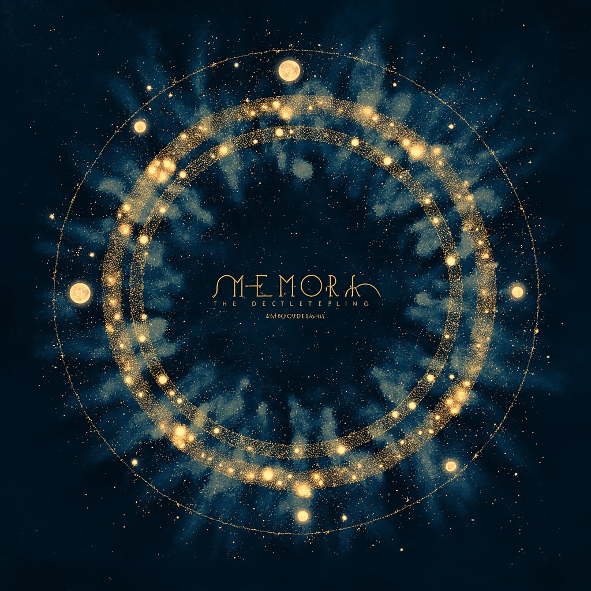

# Memora - ai agent记忆系统

<p align="center">
  
</p>

> ✨ Memory + Aurora — 记忆极光，让知识自由流动

将 nanobot 对话历史转换为"网页"节点，使用 PageRank 算法进行重要性排序，通过混合搜索（语义相似度 + PageRank + 时效性）实现智能检索。

## Core Concept

```
对话回合 → 网页节点 → 向量嵌入 + PageRank分数
                ↓
         混合检索引擎
   (0.4×语义 + 0.4×PageRank + 0.2×时效性)
```

## Architecture

| 模块 | 文件 | 职责 |
|------|------|------|
| 数据模型 | `src/models.py` | MemoryNode, SearchResult |
| 存储层 | `src/storage.py` | Markdown + YAML Frontmatter |
| 向量嵌入 | `src/embeddings.py` | sentence-transformers |
| PageRank | `src/pagerank.py` | NetworkX 图谱算法 |
| 检索引擎 | `src/retrieval.py` | 混合排序 |
| 主入口 | `src/memory_system.py` | MemorySystem 类 |
| Web查看器 | `web/viewer.py` | Flask Web界面 |

## Quick Start

```bash
# 1. 安装依赖
pip install -r requirements.txt

# 2. 测试
python tests/test_memory_system.py

# 3. 启动Web查看器
python web/viewer.py
# 打开 http://localhost:5000
```

## Usage

```python
from memory_system import MemorySystem

ms = MemorySystem()

# 添加记忆
node = ms.add_memory(
    content="VRM动捕项目使用MediaPipe进行姿态估计...",
    title="VRM Motion Capture",
    tags=["project", "vrm", "motion-capture"]
)

# 搜索
results = ms.search("动捕技术", top_k=5)
for r in results:
    print(f"{r.node.title}: {r.final_score:.3f}")

# 构建PageRank图谱
ms.build_graph(auto_link=True)

# 获取相关记忆
related = ms.get_related(node.url, top_k=3)
```

## Storage Format

每个记忆节点存储为 Markdown 文件：

```markdown
---
id: 202604081730-a1b2c3d4
url: /memory/2026/04/08/a1b2c3d4
created: 2026-04-08T17:30:00
modified: 2026-04-08T17:30:00
pagerank: 1.2345
links:
  - /memory/2026/04/07/xyz789
tags: [project, vrm]
embedding_file: 202604081730-a1b2c3d4.npy
---

# 内容正文
VRM动捕项目使用MediaPipe进行姿态估计...
```

## Retrieval Formula

```
score = 0.4 × semantic_similarity 
      + 0.4 × normalized_pagerank 
      + 0.2 × recency_decay

recency_decay = exp(-λ × days)
              = 0.5^(days / 30)  # 30天半衰期
```

## Link Building Strategies

1. **Semantic Similarity** (>0.8): 自动建立语义链接
2. **Temporal Adjacency** (<24h): 时间相近的记忆互相链接
3. **Shared Tags**: 共享标签的记忆建立链接
4. **Manual**: 手动指定 `links` 字段

## Project Structure

```
Memora/
├── src/
│   ├── config.py          # 配置
│   ├── models.py          # 数据模型
│   ├── storage.py         # 存储层
│   ├── embeddings.py      # 向量嵌入
│   ├── pagerank.py        # PageRank算法
│   ├── retrieval.py       # 检索引擎
│   └── memory_system.py   # 主入口
├── web/
│   └── viewer.py          # Web查看器
├── tests/
│   └── test_memory_system.py
├── data/                  # 记忆存储（自动创建）
├── embeddings/            # 向量缓存（自动创建）
├── requirements.txt
└── README.md
```

## Why Pure Markdown?

- **Human-readable**: 双击即可查看
- **Git-friendly**: diff友好，可版本控制
- **Tool ecosystem**: Obsidian, VSCode 等工具兼容
- **No vendor lock-in**: 纯文件，无数据库依赖
- **Scales well**: 10k+ 文件后才需要优化

## License

MIT
