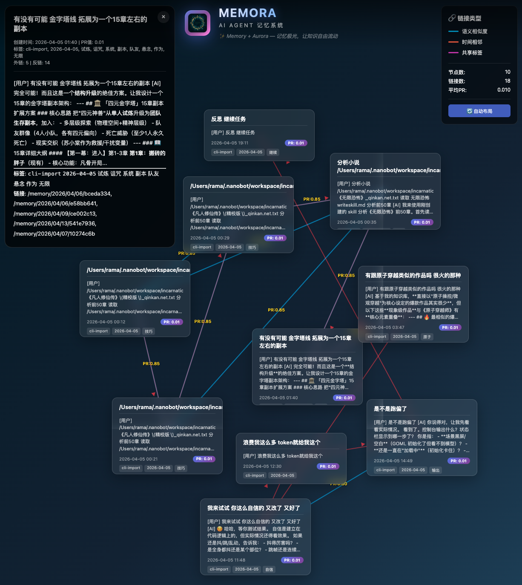

# Memora - ai agent记忆系统

<p align="center">
  
</p>

> ✨ Memory + Aurora — 记忆极光，让知识自由流动

将 ai agent如nanobot 对话历史转换为"网页"节点，使用 PageRank 算法进行重要性排序，通过多阶段混合检索（TF-IDF + 语义相似度 + PageRank + 图扩散）实现智能检索。

## Core Concept

```
对话回合 → 网页节点 → 向量嵌入 + PageRank分数 + 链接图谱
                ↓
         多阶段混合检索引擎
   (TF-IDF召回 → 子图扩散 → 语义精排)
```

## System Overview

<p align="center">
  
</p>

## Architecture

| 模块 | 文件 | 职责 |
|------|------|------|
| 数据模型 | `src/models.py` | MemoryNode, SearchResult |
| 存储层 | `src/storage.py` | Markdown + YAML Frontmatter |
| 向量嵌入 | `src/embeddings.py` | sentence-transformers + TF-IDF |
| PageRank | `src/pagerank.py` | NetworkX 图谱算法 |
| 检索引擎 | `src/retrieval.py` | TwoStageRetriever 两阶段检索 |
| 标签生成 | `src/tag_generator.py` | LLM 自动生成标签 |
| 主入口 | `src/memory_system.py` | MemorySystem 统一API |
| Web查看器 | `web/viewer.py` | Flask Web界面 (port 5001) |

## Quick Start

```bash
# 1. 安装依赖
pip install -r requirements.txt

# 2. 初始化系统（首次运行）
python3 tools/init.py

# 3. 启动Web查看器
python web/viewer.py
# 打开 http://localhost:5001

# 4. 运行测试
python tests/test_memory_system.py
```

## Usage

### 基础API

```python
from src.memory_system import MemorySystem

ms = MemorySystem()

# 添加记忆（基础方式）
node = ms.add_memory(
    content="VRM动捕项目使用MediaPipe进行姿态估计...",
    title="VRM Motion Capture",
    tags=["project", "vrm", "motion-capture"]
)

# 从对话消息添加（推荐）
# 自动完成：技能检测 + 格式化 + 标签生成 + 链接建立
node = ms.add_memory_from_messages(
    messages=[
        {"role": "user", "content": "帮我搜索新闻", "timestamp": "2026-04-13T10:00:00"},
        {"role": "assistant", "content": "正在搜索..."},
        {"role": "tool", "content": "name: web-search..."},
    ],
    source="auto-save"  # 标记来源：auto-save, cli-import, manual
)

# 搜索（自动选择最优策略）
results = ms.search("动捕技术", top_k=5)
for r in results:
    print(f"{r.node.title}: {r.final_score:.3f}")

# 查看统计
print(ms.stats())
```

### 高级检索

```python
from src.retrieval import TwoStageRetriever

retriever = TwoStageRetriever(ms.storage)

# Hybrid 检索（统一默认方法）- TF-IDF召回 + 子图扩散 + 语义精排
results = retriever.search("项目bug修复", top_k=5)

# 查看结果来源
for r in results:
    print(f"{r.node.title}: {r.final_score:.3f}")
    if r.metadata.get('is_expanded'):
        print(f"  ↳ 扩散自: {r.metadata['expanded_from']}")

# 基础检索（保留用于对比测试）
results = retriever.search_basic("项目bug修复", top_k=5)
```

### CLI 查询 Skill

```bash
# 安装 skill 后使用
python -m memora_query "那个项目"
python -m memora_query "特朗普" --top-k 10
python -m memora_query "新闻" --tags news,tech --days 7
python -m memora_query --stats  # 查看统计
```

## Retrieval Method (v3.0)

**统一使用 Hybrid 方法** - TF-IDF召回 → 子图扩散 → 语义精排

| 指标 | 数值 |
|------|------|
| **Recall@1** | 80.0% |
| **Recall@5** | 100.0% |
| **MRR** | 0.857 |
| **平均耗时** | ~1.2s/题 |

**流程:**
```
TF-IDF召回10 → 子图扩散(最大50节点) → 语义精排 → top-5
```

**评分公式:**
```
final_score = (0.7 × semantic + 0.3 × pagerank + 0.1 × tfidf) × recency_penalty
```

> 基于 50题 Benchmark 测试 (v3.0) — `search()` 默认调用 Hybrid 方法
> 
> 基础两阶段检索 (`search_basic()`) 保留用于对比测试

## Storage Format

每个记忆节点存储为 Markdown 文件：

```markdown
---
id: 202604081730-a1b2c3d4
url: /memory/2026/04/08/a1b2c3d4
created: 2026-04-08T17:30:00
modified: 2026-04-08T17:30:00
pagerank: 1.2345
source: auto-save        # auto-save | cli-import | manual
tags: [project, vrm, "2026-04-08"]
links:
  - /memory/2026/04/07/xyz789
backlinks:
  - /memory/2026/04/09/abc123
embedding_file: 202604081730-a1b2c3d4.npy
---

[用户] 如何实现VRM动捕？

[AI] VRM动捕项目使用MediaPipe进行姿态估计...
[使用的技能] web-search
```

## Scoring Formula

```
final_score = (0.7 × semantic + 0.3 × pagerank + 0.1 × tfidf) × recency_penalty

where:
- semantic: paraphrase-multilingual-MiniLM-L12-v2 余弦相似度
- pagerank: 基于 links/backlinks 图算法计算（归一化）
- tfidf: jieba + TF-IDF 快速匹配分数
- recency_penalty: 新节点(<7天) 0.3~0.8，成熟节点 1.0
```

## Link Building Strategies

1. **Semantic Similarity** (>0.8): 自动建立语义链接
2. **Temporal Adjacency** (<24h): 时间相近的记忆互相链接
3. **Shared Tags**: 共享标签的记忆建立链接
4. **Manual**: 手动指定 `links` 字段
5. **Incremental**: 新节点自动链接到相似旧记忆

## Auto-Save Hook

nanobot 通过 `on_response` hook 自动保存对话：

```python
# 触发条件
- 对话长度 > 10 字符
- 包含重要关键词 或 长度 > 30 字符

# 处理流程
1. 提取最近3轮对话
2. 检测使用的 skills（从 tool_calls 和对话内容）
3. 格式化对话（添加 [用户]/[AI] 标签）
4. 生成标题和标签
5. 写入 _pending_queue.jsonl
6. Heartbeat 调用 process_queue.py 导入
```

**Skill 检测逻辑**（可靠来源）：
- ✅ `tool_calls.function.name` — 实际调用的函数
- ✅ `user` 输入内容 — 用户意图
- ✅ `assistant` content/reasoning — AI思考过程
- ❌ `tool` 返回内容 — 排除（避免 list_dir 等误报）

## Project Structure

```
Memora/
├── logo.png                  # 品牌 Logo
├── info.png                  # 系统架构图
├── src/                      # 核心源代码
│   ├── config.py             # 配置
│   ├── models.py             # 数据模型 (MemoryNode, SearchResult)
│   ├── storage.py            # 存储层 (Markdown + YAML)
│   ├── embeddings.py         # 向量嵌入（语义+TF-IDF）
│   ├── pagerank.py           # PageRank算法
│   ├── retrieval.py          # 检索引擎（TwoStageRetriever）
│   └── tag_generator.py      # 标签生成
│
├── data/                     # 记忆数据（按日期组织）
│   └── YYYY/MM/DD/
│       └── YYYYMMDD-HHMM-xxxxxxxx.md
│
├── embeddings/               # 向量缓存
│   └── YYYYMMDD-HHMM-xxxxxxxx.npy
│
├── index/                    # 索引文件
│   ├── pagerank.pkl
│   ├── tfidf_vectorizer.pkl
│   └── tfidf_matrix.npz
│
├── tools/                    # 工具脚本
│   ├── init.py               # 系统初始化
│   ├── build_graph.py        # 构建链接图谱
│   ├── build_index.py        # 构建TF-IDF索引
│   ├── generate_tags.py      # 生成标签
│   ├── update_pagerank.py    # 更新PageRank
│   ├── process_queue.py      # 处理待导入队列
│   ├── queue_watcher.py      # 队列监控
│   ├── import_cli_direct.py  # CLI历史数据导入
│   ├── generate_pagerank_graph.py  # PageRank可视化
│   └── debug_*.py            # 调试工具
│
├── generate_network_graph.py # 记忆网络可视化（根目录）
│
├── benchmark/                # Benchmark测试
│   ├── benchmark_longmemeval.py
│   ├── compare_methods.py
│   └── *.json                # 测试结果
│
├── tests/                    # 单元测试
│   └── test_memory_system.py
│
├── web/                      # Web界面
│   └── viewer.py             # Flask Web查看器
│
├── _pending_queue.jsonl      # 待导入队列
└── README.md
```

## Tools Reference

| 工具 | 用途 | 示例 |
|------|------|------|
| `init.py` | 首次初始化 | `python3 tools/init.py` |
| `build_graph.py` | 构建链接图谱 | `python3 tools/build_graph.py` |
| `build_index.py` | 构建TF-IDF索引 | `python3 tools/build_index.py` |
| `process_queue.py` | 处理待导入队列 | `python3 tools/process_queue.py` |
| `generate_tags.py` | 为所有节点生成标签 | `python3 tools/generate_tags.py` |
| `update_pagerank.py` | 重新计算PageRank | `python3 tools/update_pagerank.py` |
| `debug_graph.py` | 可视化链接图 | `python3 tools/debug_graph.py` |
| `debug_pagerank.py` | 调试PageRank | `python3 tools/debug_pagerank.py` |

### 可视化生成器

**PageRank 图谱可视化** - 生成可交互的 PageRank 分布图
```bash
python tools/generate_pagerank_graph.py --data data/2026/04/05 --output pagerank_graph_20260405.html
```
- 响应式全屏布局
- 彩色边类型：青色(语义相似度)、橙色(时间相邻)、紫色(共享标签)
- Top PageRank 节点排行

**记忆网络图** - 生成节点关系可视化（玻璃态卡片设计）
```bash
python generate_network_graph.py  # 使用最近10个节点
```
- 可拖拽卡片布局
- 实时 SVG 连线
- 三种链接类型切换
- 展开详情面板

**使用生成的可视化:**
```bash
open pagerank_graph_20260405.html
open network_graph_10nodes.html
```

## Why Pure Markdown?

- **Human-readable**: 双击即可查看
- **Git-friendly**: diff友好，可版本控制
- **Tool ecosystem**: Obsidian, VSCode 等工具兼容
- **No vendor lock-in**: 纯文件，无数据库依赖
- **Scales well**: 10k+ 文件后才需要优化

## Related Skills

| Skill | 用途 | 位置 |
|-------|------|------|
| **memora-query** | 查询Memora记忆，支持三种检索模式 | `skills/memora-query/` |
| **memora-bridge** | nanobot与Memora桥梁，自动保存对话 | `skills/memora-bridge/` |

## Skill Quality & Self-Evolution System

Memora 内置 Skill 质检与自进化闭环，实现 AI Agent 技能的持续优化：

### 质检触发机制

| 触发点 | Hook | 功能 |
|--------|------|------|
| `before_llm_call` | 技能选择后 | 质检本轮 tool_calls，判断是否使用最优 skill |
| `on_response` | 对话结束后 | 智能判断对话价值，自动保存到记忆队列 |

### 质检流程

```
nanobot 调用 tools → 触发 before_llm_call hook
         ↓
    提取本轮 tool_calls
         ↓
    skill_quality_judge 评估
         ↓
    双存储：
    ├── 记忆节点 metadata (供向量检索)
    └── skill/skill_status.md (供 skillX 推荐引擎)
```

### 质检标准

| 状态 | 含义 | 示例 |
|------|------|------|
| `success` | 正确使用合适的 skill | 用 `memora-query` 检索记忆 |
| `partial` | 可用 skill 但未使用，用了基础工具 | 用 `exec+grep` 而非 `memora-query` |
| `failed` | skill 调用失败 | `ModuleNotFoundError` 等 |
| `unknown` | 非 skill 类工具调用 | `read_file`, `edit_file` 等基础工具 |

### 自进化闭环

```
┌─────────────────────────────────────────────────────────┐
│  1. 记录问题                                             │
│     - skill_status.md 质检记录                          │
│     - 包含：状态、原因、更优选择                          │
└─────────────────────────────────────────────────────────┘
                           ↓
┌─────────────────────────────────────────────────────────┐
│  2. 触发修复 (Heartbeat 或手动)                          │
│     - 子 Agent 读取 skill_status.md                     │
│     - 分析问题 skill 代码                                │
│     - 执行修复（改代码/重命名/改配置）                    │
└─────────────────────────────────────────────────────────┘
                           ↓
┌─────────────────────────────────────────────────────────┐
│  3. 标记修复                                             │
│     - 在 skill_status.md 追加修复状态标记                 │
│     - 记录修复时间和内容                                 │
└─────────────────────────────────────────────────────────┘
                           ↓
┌─────────────────────────────────────────────────────────┐
│  4. 持续优化                                             │
│     - 下次推荐时参考历史质检记录                          │
│     - 问题 skill 自动降权，优质 skill 优先推荐            │
└─────────────────────────────────────────────────────────┘
```

### 质检数据格式

```markdown
## 质检记录 2026-04-14 20:12
| Skill | 状态 | 原因 | 更优选择 |
|-------|------|------|----------|
| memora_query | failed | ModuleNotFoundError | - |
| exec | partial | 使用了grep而非memora-query | memora-query |

**修复状态**: ✅ 已修复 (2026-04-14 20:15)  
**修复内容**: 目录重命名为 memora_runner，修复导入路径
```

---

## Recent Updates

### 2026-04-14
- ✅ **Skill 质检与自进化闭环** - 新增 `skill_quality_judge` + `before_llm_call` hook
  - 自动质检每次 tool_calls，判断是否使用最优 skill
  - 双存储机制：记忆节点 metadata + `skill/skill_status.md`
  - 支持子 Agent 自动修复问题 skill，标记修复状态
- ✅ **Skill 质检双存储机制** - `skill_quality_judge` 结果同时写入：
  - 记忆节点 metadata（向量检索用）
  - `skill/skill_status.md`（skillX 推荐引擎用）
- ✅ **质检纠错闭环** - 标记 `better_choice` 的 skill 自动降权，供后续推荐优化
- ✅ **精简 process_queue.py** - 删除冗余代码 106 行，简化队列处理逻辑
- ✅ **为 skillX 提供数据基础** - 质检记录现在可供推荐引擎读取分析

### 2026-04-13
- ✅ **网络可视化** - 创建 `generate_network_graph.py`（玻璃态卡片 + 可拖拽 + SVG连线）
- ✅ **PageRank 可视化** - `generate_pagerank_graph.py` 支持彩色边类型、响应式布局
- ✅ **历史数据导入完成** - 4月全部数据 ~1100+ 节点已导入
- ✅ **v3.0 统一 Hybrid 检索** - `search()` 默认使用 Hybrid，简化 API
- ✅ 重构 memora-query skill - 直接调用 Memora 核心，删除独立实现
- ✅ 50题 Benchmark 测试 - Recall@5 100%, MRR 0.857
- ✅ 修复 Skill 检测逻辑（排除 tool 返回内容，避免 list_dir 误报）
- ✅ 统一 `add_memory_from_messages` API（自动检测 skills、格式化、打标签）
- ✅ 优化检索公式权重（0.7语义 + 0.3PageRank + 0.1TF-IDF）
- ✅ 修复时效性惩罚（新节点降权，成熟节点1.0）

### 2026-04-12
- ✅ TwoStageRetriever 三阶段检索（TF-IDF召回 + 子图扩散 + 语义精排）
- ✅ 三种检索方法完成基准测试（hybrid 86.7% Recall@5）
- ✅ 增量链接机制（新节点自动链接相似旧记忆）
- ✅ auto-save hook v6 简化版（只检测存在的 skill）

## License

MIT
